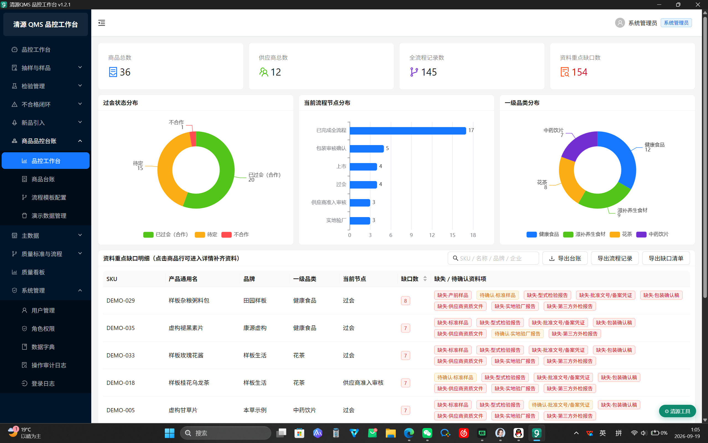
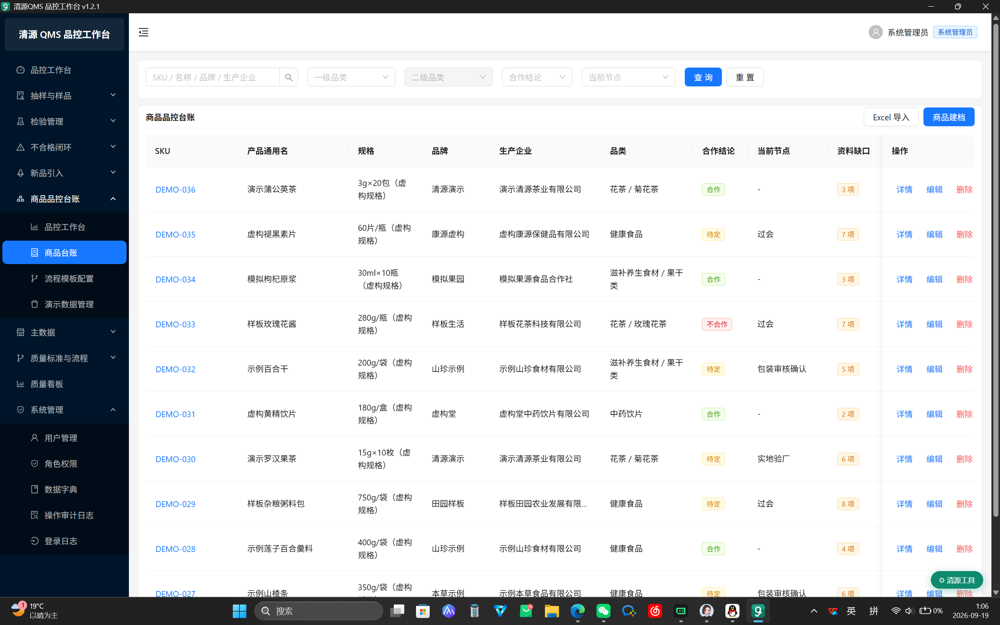
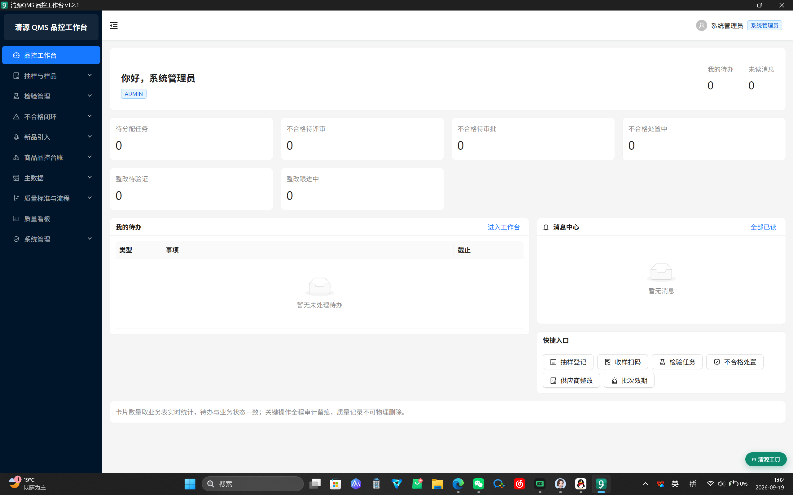
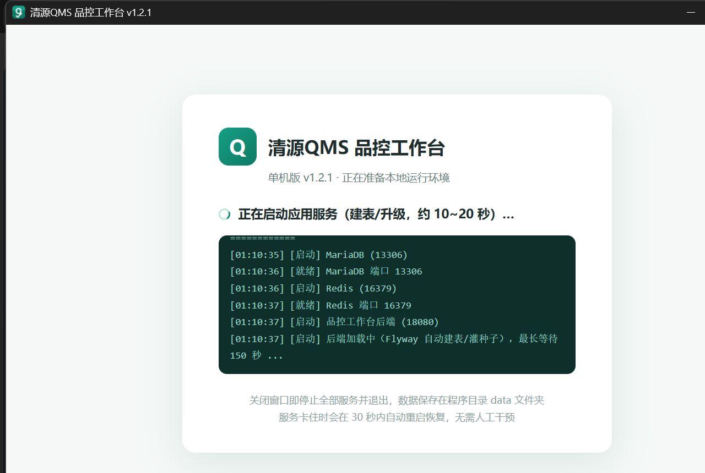
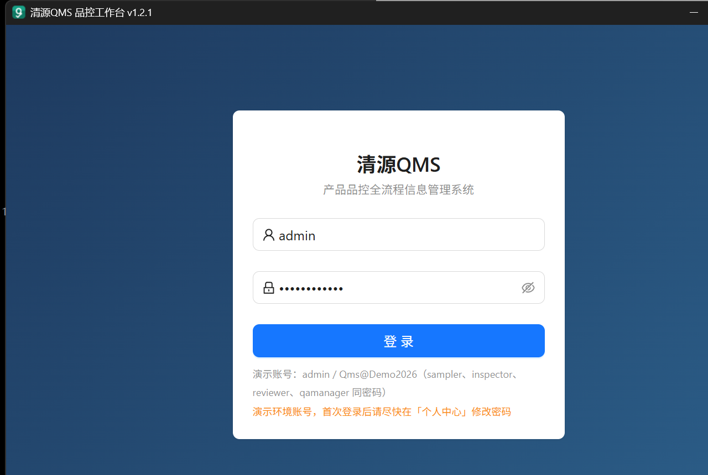
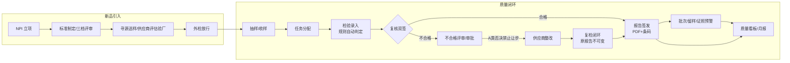
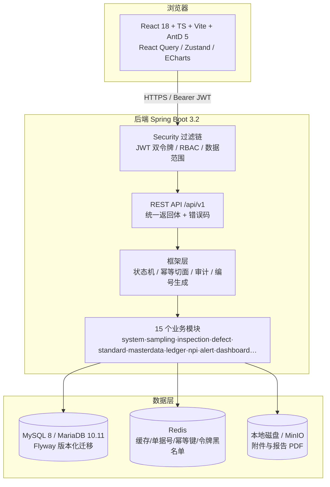

# 清源 QMS · 产品品控全流程工作台


[](https://github.com/newway74/qingyuan-qms/releases/latest)


> 一套覆盖**新品引入 → 标准制定 → 外检放行 → 上市后质量闭环**的制造企业 QMS（质量管理系统），内置 RBAC 权限、电子签名、状态机、幂等控制、审计留痕与数据范围隔离；同时提供 **Windows 免安装单机版**（无黑窗桌面 App，内置 JRE/MariaDB/Redis，双击即用、关窗即走）与 **Docker 一键编排**两种分发形态。

## 界面速览







<table>
<tr>
<td width="50%"></td>
<td width="50%"></td>
</tr>
</table>

> 单机版是独立桌面窗口（pywebview + WebView2），不是浏览器里的网页；关闭窗口即优雅停止全部内置服务并退出，无托盘残留。

## 项目亮点

- **完整业务闭环**：抽样 → 收样 → 分配 → 检验录入与自动判定 → 复核双签 → 报告签发（PDF + Code128 条码）→ 不合格评审/审批 → 供应商整改 → 复检闭环 → 批次/留样/证照预警 → 质量看板/月报；另含新品引入（NPI）立项、三档标准评审、供应商评估/验厂、外检放行全流程。
- **合规约束写进系统**：敏感动作二次密码电子签名 + `sys_audit_log` 留痕；A 类（一票否决）缺陷强制不合格且**禁止让步接收、禁止复核改判**；复检以子任务执行，**原任务、原报告不可变**。
- **工程化扎实**：16 个 Flyway 版本化迁移（建表/RBAC/字典/流程/台账/演示种子）、Redis+DB 双保险单据号、乐观锁、逻辑删除、接口幂等切面、数据权限范围、全局异常与统一错误码。
- **质量内建**：JUnit5 单测 + 真实容器/本机中间件集成测试，JaCoCo 关键包行覆盖率 ≥80% 硬门禁。
- **三种使用形态**：源码开发、`docker compose` 五服务编排、Windows 单机离线版（**pywebview 无黑窗桌面 App** + PyInstaller 启动器 + 便携 MariaDB/Redis/JRE，自动初始化、业务级健康探针 + 假死快照自愈、关窗即优雅退出）。

## 关于开发方式：AI 结对编程的人机分工

本项目由开发者**独立完成需求分析、业务规则设计、技术选型与验收**，代码在 AI 编程助手中以"人主导决策、AI 负责实现、逐个用例验证"的结对方式产出。开源时保留这一说明，是为了把边界讲清楚，而不是用 AI 充数：

- **人负责（不可替代的部分）**：把品控业务拆成状态机与角色矩阵（如 A 类缺陷一票否决、复检原报告不可变）、划定模块边界与数据模型、决定每一个异常码与合规约束、对 AI 产出做 code review 并设计验证手段。
- **AI 负责**：样板代码、CRUD、SQL、前端页面与单测用例的批量生成，以及按既定方案重构。
- **典型案例**：① 单机版在中文 Windows 路径下出现编码故障，AI 给出假设、人设计复现与对照实验逐层定位；② 看门狗从"只探 health 端点"升级为"业务探针（强制 `SELECT 1` + Redis PING）+ 连续失败自动落线程快照再重启"，解决 health 偶发 UP 但连接池已耗尽的盲区；③ 前端 antd 受控弹层告警，逐页确认挂载时机后统一改造。
- **可信度靠验证而不是靠感觉**：后端 76 项自动化测试（真实 Spring 容器 + 本机 MariaDB/Redis，覆盖主链路/越权/不合格闭环/原报告不可变）、JaCoCo 关键包行覆盖 ≥80% 硬门禁；单机版每次构建都做**全新解压目录冷冒烟**（登录、挂起 Java 进程验证 30 秒级自愈、WM_CLOSE 验证端口释放与数据库 Normal shutdown）。

## 业务总览



## 系统架构



## 快速开始

### 方式一：Windows 单机离线版（零依赖，演示最快）

1. 在 [Releases 页面](https://github.com/newway74/qingyuan-qms/releases/latest)下载 `QingyuanQMS_vX.Y.Z_windows_x64.zip`，**完整解压**到桌面/文档等普通文件夹（勿在压缩包预览或微信接收目录里直接运行）；
2. 双击文件夹内 `清源QMS.exe`（首次运行会自动在桌面与开始菜单创建快捷方式），启动页分段显示初始化进度，约 20 秒后直接进入系统登录界面——**全程没有黑色命令行窗口**；
3. 演示账号 `admin` / `Qms@Demo2026`；**关闭窗口即优雅停止全部内置服务并退出**（不驻留托盘、不自启），数据保存在程序目录 `data/` 文件夹。详细说明见包内 `使用说明.txt`。

> 端口 18080/13306/16379 均只绑定 127.0.0.1，不影响本机已有服务。系统需为 Windows 10/11（WebView2 Runtime，Win11 已内置；缺失时启动器会引导安装）。

### 方式二：Docker Compose（五服务一键起）

前置：Docker Desktop / Docker Engine 20+。

```bash
cp .env.example .env      # 必填 QMS_JWT_SECRET，详见 .env.example 中的生成命令
docker compose up -d --build
```

入口 <http://localhost/>（默认 80 端口，可用 `FRONTEND_PORT` 改）；MinIO 控制台 <http://localhost:9001>。
清空数据卷重建：`docker compose down -v && docker compose up -d --build`。

### 方式三：源码开发（裸机）

前置：JDK 17、Maven 3.9+、Node 20+、MySQL 8（或 MariaDB 10.11）、Redis 7。

```bash
# 1) 建空库（表结构与种子由 Flyway 自动完成）
mysql -uroot -p -e "CREATE DATABASE qms DEFAULT CHARACTER SET utf8mb4 COLLATE utf8mb4_unicode_ci;"

# 2) 后端（默认 dev profile）
cd backend
mvn spring-boot:run        # http://localhost:8080/api/v1/health

# 3) 前端
cd ../frontend
npm install
npm run dev                # http://localhost:5173 （/api 代理到 8080）
```

生产构建：`mvn clean package`（产物 `backend/target/qingyuan-qms-backend.jar`）、`npm run build`（产物 `frontend/dist/`，交 Nginx，配置见 `frontend/nginx.conf`）。

## 演示账号

| 账号 | 密码 | 角色 |
|---|---|---|
| admin | `Qms@Demo2026` | 系统管理员 ADMIN |
| sampler | `Qms@Demo2026` | 收样员 SAMPLER |
| inspector | `Qms@Demo2026` | 检验员 INSPECTOR |
| reviewer | `Qms@Demo2026` | 复核人 REVIEWER |
| qamanager | `Qms@Demo2026` | 质量主管 QA_MANAGER |

> **安全提示**：以上为 V13 迁移轮换后的演示账号（旧版弱密码 admin123/Qms@12345 已失效），仅供本地与演示环境。正式部署请**第一时间修改全部默认密码**，或停用/删除多余演示账号；生产环境必须通过环境变量 `QMS_JWT_SECRET` 配置独立 JWT 密钥（缺失时 prod profile 拒绝启动）。

## 核心功能矩阵

| 域 | 功能 |
|---|---|
| 基础平台 | RBAC 用户/角色/权限/部门、数据范围隔离、操作审计日志、站内消息、待办中心 |
| 主数据 | 品类树（树形维护）、产品档案/SKU、供应商与证照、检验标准模板、JJF1070 净含量分档 |
| NPI 新品引入 | 立项评审、三档（企业/行业/国标）标准比对、供应商评估与验厂、外检放行、项目时间线 |
| 检验执行 | 抽样收样、任务分配、移动端式录入、规则引擎自动判定、必检项校验、复核电子双签 |
| 报告与放行 | OpenHTMLtoPDF 报告（内嵌中文字体）、ZXing Code128 样品条码、EasyExcel 质量月报 |
| 不合格处置 | 自动立案、原因分析、让步/返工/报废审批流、A 类否决拦截、供应商整改与复检闭环 |
| 预警看板 | SLA 超期、批次近效/过期、留样到期、证照临期多色预警；ECharts 质量看板 |
| 系统工程 | 单据号 Redis+DB 双保险、幂等防重、乐观锁、逻辑删除、JWT 双令牌、OpenAPI 文档 |

## 目录结构

```
qingyuan-qms/
├── backend/                Spring Boot 后端
│   ├── src/main/java/com/qms/
│   │   ├── common/         统一返回体/错误码/异常/基础实体
│   │   ├── config/         Web/Security/MyBatis/OpenAPI/Redis 配置
│   │   ├── framework/      安全(JWT)、状态机、幂等、审计、编号生成、数据范围
│   │   ├── integration/    外部中台适配（SSO 等，local/remote 可切）
│   │   └── modules/        15 个业务模块（system/sampling/inspection/defect/
│   │                        standard/masterdata/ledger/process/message/workbench/
│   │                        alert/dashboard/attachment/npi/todo）
│   ├── src/main/resources/db/migration/  Flyway V1~V16（建表/RBAC/字典/流程/台账/种子）
│   └── src/test/           单元测试 *Test + 集成测试 *IT
├── frontend/               React 前端（dev 5173，/api 代理 8080）
├── docs/screenshots/       README 界面截图
├── offline-build/          Windows 单机版（Python 标准库 + pywebview + PyInstaller）
│   ├── launcher_qms.py     编排层：拉起三件套/业务探针/假死快照/自愈重启/优雅关停
│   ├── app_gui.py          GUI 层：无黑窗窗口、启动页、关窗即退、桌面快捷方式
│   ├── 品控工作台.spec       PyInstaller 打包配置
│   └── 使用说明.txt
├── scripts/
│   └── build-offline.ps1   一键构建单机分发包（后端/前端/启动器/组装/压缩/冒烟）
├── docker-compose.yml      MySQL+Redis+MinIO+后端+前端 编排
├── .env.example            环境变量样例（含 QMS_JWT_SECRET 生成方式）
├── CHANGELOG.txt           单机版版本变更记录
├── LICENSE                 Apache-2.0
└── README.md
```

## 数据库迁移（Flyway）

迁移位于 `backend/src/main/resources/db/migration/`，启动时自动执行，**历史迁移只增不改**：

| 版本 | 内容 |
|---|---|
| V1 | 全量业务表（逻辑删除、乐观锁、审计列、唯一索引） |
| V2 | RBAC（用户/角色/权限/字典）+ 演示账号种子 |
| V3~V5 | 品类树、商品/SKU/供应商/证照/批次、检验标准模板、JJF1070 分档 |
| V6 | 默认品控流程九节点与动作定义（状态机数据源） |
| V7 | 检验模块配套结构 |
| V8 | 新增权限码 |
| V9 | 站内消息 qc_message 与消息权限 |
| V10 | 预警演示数据（日期相对 CURDATE，幂等） |
| V11~V12 | NPI 模块结构/字典与演示项目（NOT EXISTS 幂等守卫） |
| V13 | 轮换全部演示账号密码为 `Qms@Demo2026`（以 V2 种子哈希为守卫，不改用户已改密码） |
| V14~V16 | 商品品控全流程台账（商品/流程模板/节点记录/资料缺口）、看板统计与演示种子、看板权限码 |

## 接口文档与约定

启动后端后：Swagger UI <http://localhost:8080/swagger-ui.html>，OpenAPI JSON <http://localhost:8080/v3/api-docs>。

接口统一在 `/api/v1` 下，除登录/健康检查外均需 `Authorization: Bearer <accessToken>`。返回体：

```json
{ "code": "0", "message": "ok", "data": {}, "traceId": "..." }
```

`code=0` 成功；业务错误 HTTP 200 + 非零 code；400 参数校验失败；401 未登录；403 权限不足。核心错误码：

| code | 含义 |
|---|---|
| CONCURRENT_VERSION_CONFLICT | 乐观锁冲突（数据已被他人修改） |
| REPEAT_SUBMIT | 重复提交（幂等键处理中或已提交） |
| AUTH_BAD_CREDENTIAL / AUTH_USER_DISABLED | 用户名密码错误 / 账号停用 |
| AUTH_PASSWORD_CONFIRM_FAIL | 电子签名二次密码校验失败 |
| BIZ_STATE_INVALID | 当前单据状态不允许该操作 |
| BIZ_REQUIRED_ITEM_MISSING | 存在未录入的必检项 |
| BIZ_JUDGE_VETO_FAIL | 严重 A 类项不合格，禁止判合格/让步/改判 |
| INTEGRATION_UNAVAILABLE | 外部中台服务不可用 |

## 配置与环境变量

| 变量 | 默认（dev） | 说明 |
|---|---|---|
| `QMS_JWT_SECRET` | 空（dev/offline 用内置兜底，**prod 必填**） | JWT HS256 签名密钥，随机字符串 ≥32 字节；prod 缺失即拒绝启动 |
| `MYSQL_HOST/PORT/DB/USER/PASSWORD` | localhost/3306/qms/root/root123 | 数据库连接；prod profile 中 `MYSQL_PASSWORD` 无默认值 |
| `REDIS_HOST/PORT/PASSWORD` | localhost/6379/空 | Redis 连接 |
| `STORAGE_PROVIDER` | local | `local` 本地磁盘 / `minio` 对象存储 |
| `MINIO_ENDPOINT/ACCESS_KEY/SECRET_KEY/BUCKET` | 本地默认 | MinIO 连接信息 |
| `STORAGE_LOCAL_DIR` | ./data/attachments | 本地附件存储目录 |
| `APP_PORT`（offline） | 18080 | 单机版服务端口 |

## 测试

```bash
cd backend
mvn verify
```

- **单元测试**：判定引擎全分支、JJF1070 分档、状态机非法转移/角色门禁、编号生成（Redis 播种/对齐/降级/并发锁等待）、JWT 签发解析/过期/篡改/**prod 缺密钥 fail-fast**、幂等切面、权限通配、数据范围。
- **集成测试**：真实 Spring 容器 + 安全过滤链 + MockMvc，覆盖合格主链路（抽样→收样→分配→录入→复核双签→签发 + 三类越权 403/401 + 非法状态转移）与不合格闭环（A 类否决自动立案、让步拦截、审批驳回/通过、整改先 FAIL 后 PASS、复检双签、原报告逐字节不变、父子关闭）。
- **覆盖率门禁**：JaCoCo 对关键包行覆盖率 ≥80%；报告 `target/site/jacoco-unit/index.html`。
- 中间件：默认用本机 MariaDB 独立库 `qms_test` + Redis db15（自动建库/清库，可重复执行）；装 Docker 后 `mvn verify -DTESTCONTAINERS=true` 改用一次性 Testcontainers。

## 外部系统对接点

| 对接项 | 当前实现 | 切换方式 |
|---|---|---|
| 单点登录 SSO | `SsoAdapter` 接口 + `SsoLocalImpl` 本地账号 | `qms.integration.sso=local`；接公司 SSO 时新增 `@ConditionalOnProperty(havingValue="remote")` 适配器，业务代码零改动 |
| 商品/采购中台 | 主数据系统内维护（含导入/页面管理） | 预留 `qms.integration.product/purchase=local` |
| 对象存储 | 统一 Storage 接口 + 本地磁盘实现 | `STORAGE_PROVIDER=minio/local`，新增 OSS 实现 + 条件装配即可 |
| 定时任务 | Spring `@Scheduled`（SLA 整点、留样/证照/批次每日 08:30） | 阈值/cron 均可环境变量覆盖；迁 XXL-Job 只需把扫描方法注册为 JobHandler |

## Windows 单机版实现

单机版分两层：`launcher_qms.py`（编排层，Python 标准库）与 `app_gui.py`（GUI 层，pywebview + 系统 WebView2），PyInstaller 打成 `windowed` 单 exe，无任何控制台黑窗：

- **进程编排**：首启自动初始化包内便携 MariaDB 数据目录，依次拉起 MariaDB(13306) → Redis(16379) → Spring Boot(18080)，启动页实时回显分段进度；子进程全部 `CREATE_NO_WINDOW` 并纳入 Windows Job Object（`KILL_ON_JOB_CLOSE`），任何情况下进程树零残留。
- **业务级看门狗**：每 10 秒探测 `/api/v1/diag/ping`——该端点用独立连接强制 3 秒超时执行 `SELECT 1` 并做 Redis PING，分项返回 DB/Redis 状态与延迟，能发现"health 偶发 UP 但连接池已耗尽"的假死；连续 3 次失败先抓取诊断快照（探针时间线、jstack 线程转储、health 响应、后端与启动器日志尾部，落盘 `logs/freeze-*`），再自动重启后端，约 60 秒恢复并自动刷新页面。
- **关窗即走**：点窗口关闭按钮先拦截事件，执行"通知 Spring 优雅停机 → Redis SAVE → MariaDB 正常 SHUTDOWN"再退出，实测三端口秒级释放、数据库日志为 Normal shutdown；无托盘图标、无开机自启。
- **桌面体验**：首次运行自动创建桌面/开始菜单快捷方式（PowerShell WScript.Shell，中文路径经环境变量传递避免 ANSI 乱码）；窗口内注入"清源工具"悬浮条（刷新/重启服务/打开日志与数据目录）。
- **一键构建**：`scripts/build-offline.ps1` 完成后端打包 → 前端构建 → 启动器 PyInstaller → 组装 → 压缩，并在**全新解压的临时目录**做冷启动冒烟（双健康端点、业务探针、登录、挂起 Java 验证自愈、WM_CLOSE 验证端口释放），全程无需人工。

## 数据备份（Docker 形态）

```bash
# 备份
docker exec qms-mysql mysqldump -uroot -p"$MYSQL_ROOT_PASSWORD" --single-transaction --routines qms > qms_$(date +%F).sql
# 恢复：新建空库后 mysql qms < backup.sql（勿重复执行 Flyway）
```

Redis 仅承载序列、幂等键与令牌黑名单，丢失后单号序列自动以数据库当日最大值重新播种，无数据损失。

## 合规约束

- 检验提交、复核签署、不合格审批、整改验证等敏感动作均需二次密码（电子签名）并写 `sys_audit_log`；月报/报告导出同样留痕。
- A 类（含一票否决）缺陷：强制不合格，禁止让步接收、禁止复核改判（`BIZ_JUDGE_VETO_FAIL`）。
- 复检以子任务（roundNo+1）执行，**原任务、原报告不可变**，闭环后父子任务方可关闭。
- 关键业务表逻辑删除（无物理删除入口）、`lock_version` 乐观锁、单据号 Redis+DB 双保险唯一。

## License

[Apache License 2.0](./LICENSE)。选择 Apache-2.0 而非 MIT：除版权许可外，它提供显式的**专利授权与专利诉讼终止条款**，更适合质量管理这类可能进入企业/工业场景的系统，对商用二次开发也更友好。
